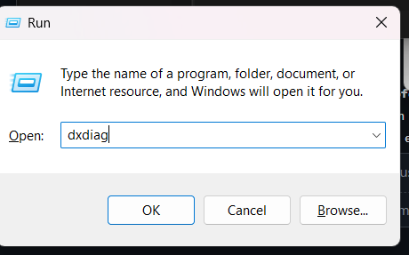
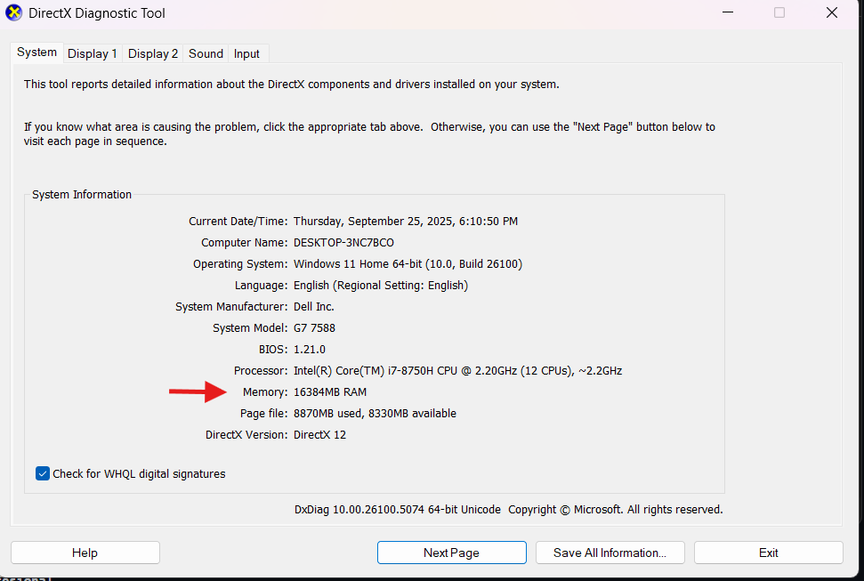
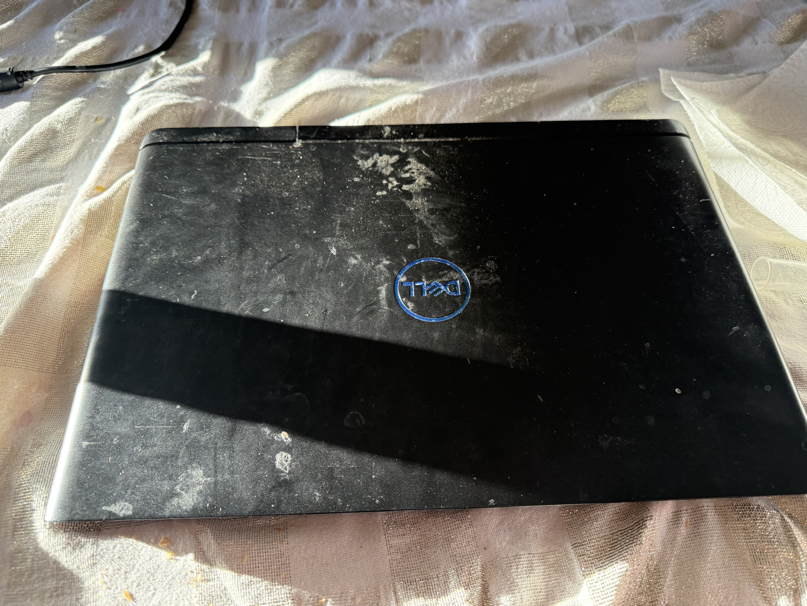
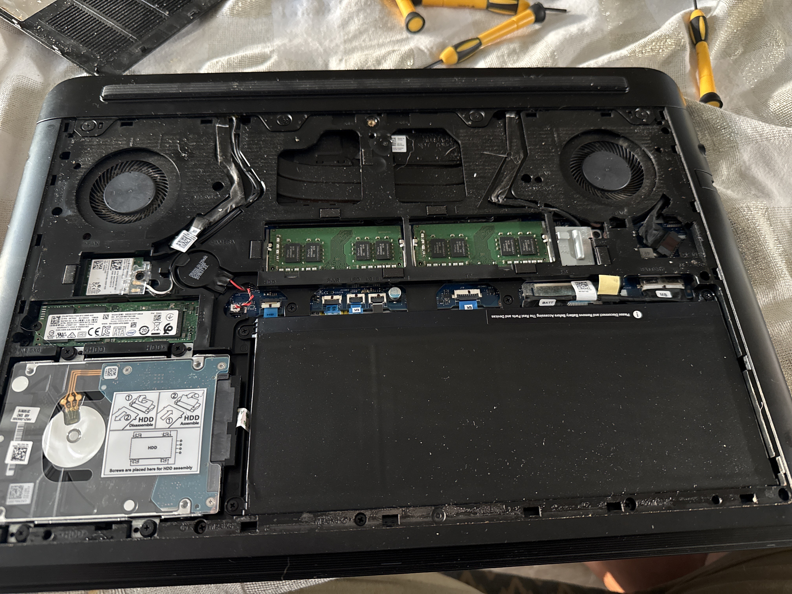
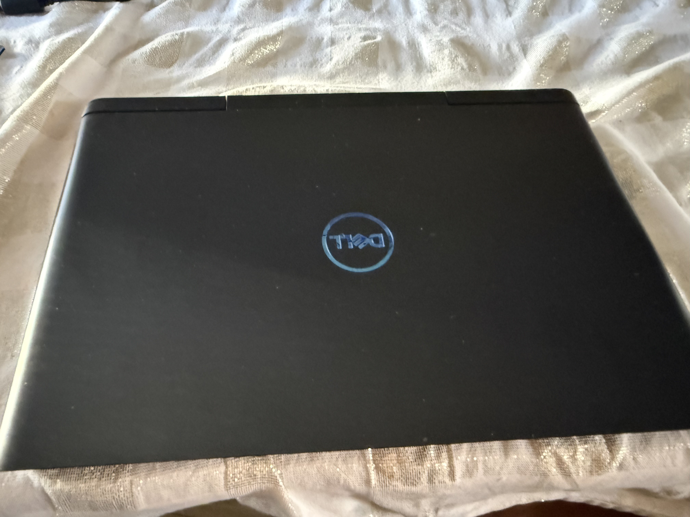
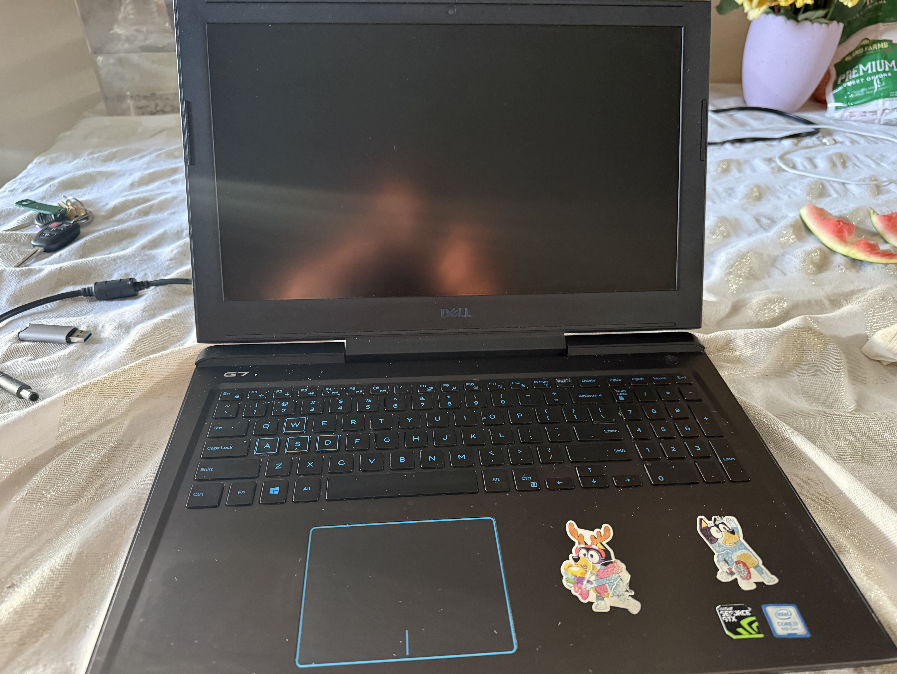
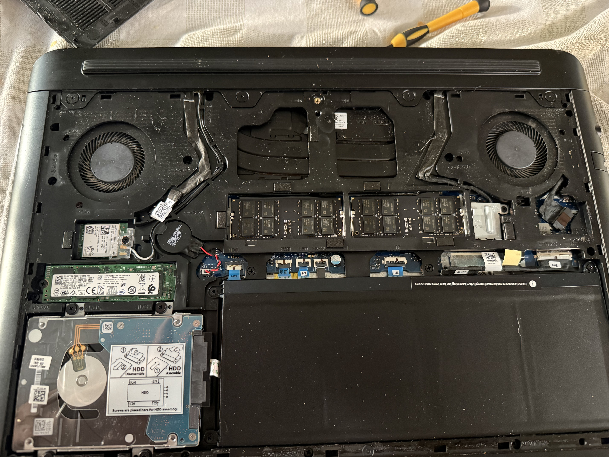
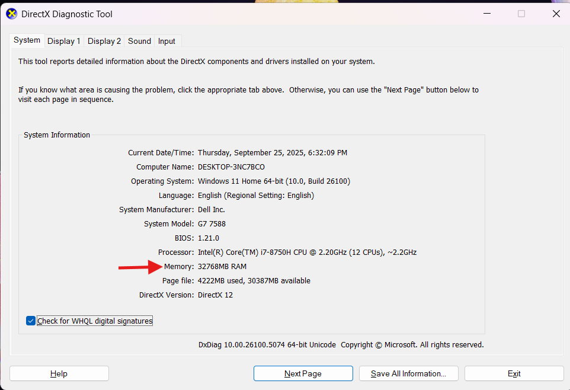

# 💻 RAM Upgrade in Dell G7 7588 Laptop / Actualización de RAM en Dell G7 7588

## 📖 Project Overview / Resumen del Proyecto
**EN:** This project documents the process of upgrading RAM in a Dell G7 7588 laptop, improving system performance for multitasking, development, and data analysis tasks.  
**ES:** Este proyecto documenta el proceso de actualización de memoria RAM en una laptop Dell G7 7588, mejorando el rendimiento del sistema para multitarea, desarrollo y análisis de datos.  

---

## 🔧 Procedure / Procedimiento
- **EN:** Verified compatibility of DDR4 RAM modules (frequency and capacity).  
- **ES:** Verificación de compatibilidad de los módulos DDR4 (frecuencia y capacidad).  

- **EN:** Safely disassembled the laptop back cover.  
- **ES:** Desensamblaje seguro de la tapa trasera del equipo.  

- **EN:** Installed new RAM modules and tested in BIOS/OS.  
- **ES:** Instalación de nuevos módulos RAM y prueba en BIOS/SO.  

---

## 📊 Results / Resultados
- **EN:** System upgraded from 8 GB → 16 GB RAM.  
- **ES:** El sistema fue actualizado de 8 GB → 16 GB de RAM.  

**EN:** Benefits:  
- Smoother multitasking and programming environments.  
- Ready for development and data analysis projects.  

**ES:** Beneficios:  
- Multitarea más fluida y entornos de programación más estables.  
- Preparación para proyectos de desarrollo y análisis de datos.  

---

## 📷 Evidence / Evidencia
-   
-   
-   
- 
- - 
-   
-   
-   
-   

---

## 🎯 Professional Reflection / Reflexión Profesional
**EN:** This project strengthened my skills in hardware diagnostics, maintenance, and technical documentation.  
**ES:** Este proyecto reforzó mis habilidades en diagnóstico de hardware, mantenimiento y documentación técnica.  
